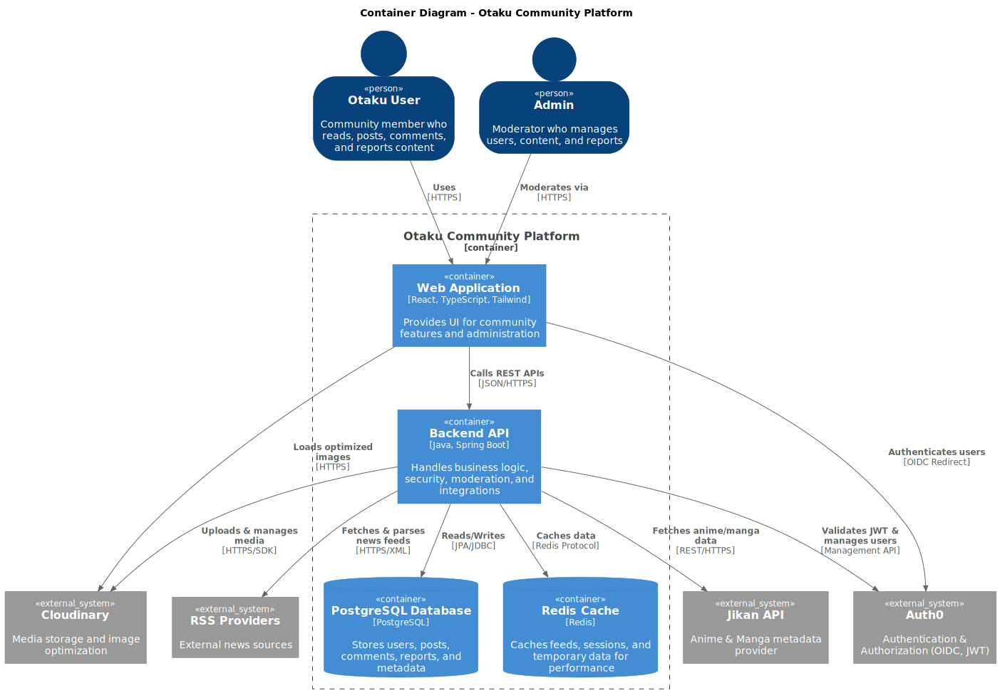

# Otaku Community

This is a full-stack web application for a community of otaku (people who love anime, manga, and Japanese culture). The project includes a backend API built with Spring Boot and two frontend applications: one built with Next.js and another with React.

## Features

- **User Authentication:** Users can sign up, log in, and manage their profiles.
- **Manga Reader:** Community-driven manga translation publishing, translator ranking system, and high-performance, mobile-friendly reading experience using Swiper.js.
- **Posts:** Users can create, read, update, and delete posts.
- **Topics:** Posts are organized by topics.
- **Feed:** Users can see a feed of posts from topics they follow.
- **Comments:** Users can comment on posts.
- **User Profiles:** Users can view and edit their profiles.

## Architecture



## Tech Stack

### Backend

- **Java 17**
- **Spring Boot 3.2.1**
- **Spring Security**
- **Spring Data JPA**
- **PostgreSQL**
- **Maven**
- **Auth0** for authentication
- **Cloudinary** for media storage
- **MapStruct** for DTO mapping
- **Springdoc OpenAPI (Swagger)** for API documentation

### Frontend (React)

- **React 18**
- **Vite**
- **TypeScript**
- **Tailwind CSS**
- **Auth0 React SDK**
- **TanStack Query** for data fetching
- **Zustand** for state management
- **Zod** for validation
- **React Router** for routing

## Project Structure

The project is a monorepo with the following structure:

```
otaku-community/
├── backend/            # Spring Boot backend
├── frontend-reactjs/   # React frontend
└── doc/                # Documentation
```

## Getting Started

### Prerequisites

- Java 17
- Node.js 20 or higher
- A PostgreSQL database
- An Auth0 account
- A Cloudinary account

### Backend Setup

1.  Navigate to the `backend` directory.
2.  Create a `application.properties` file in `src/main/resources` with your database, Auth0, and Cloudinary credentials.
3.  Run `mvn spring-boot:run` to start the backend server.
4.  The API documentation will be available at `http://localhost:8080/swagger-ui.html`.

### Frontend Setup (React)

1.  Navigate to the `frontend-reactjs` directory.
2.  Install dependencies with `npm install`.
3.  Create a `.env` file with your Auth0 and API credentials.
4.  Run `npm run dev` to start the development server.
5.  The application will be available at `http://localhost:3000`.

## Documentation

Further documentation can be found in the `doc` directory. This includes:

- API documentation
- Architecture diagrams
- Database schema
- User stories

## Contributing

Contributions are welcome! Please open an issue or submit a pull request.

## License

This project is licensed under the MIT License.
