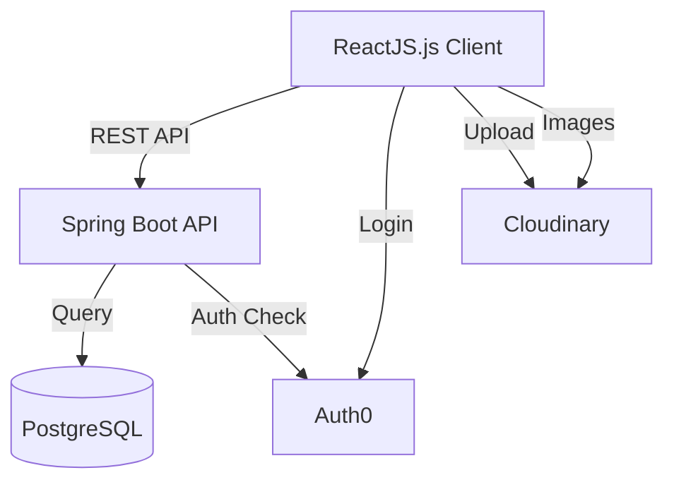

# Architecture Overview

## Tech Stack

### Backend

- **Language:** Java 17
- **Framework:** Spring Boot 3.2.1
- **ORM:** JPA/Hibernate
- **Build Tool:** Maven

### Database

- **Primary Database:** PostgreSQL 14+ (with full-text search)
- **Caching:** Redis (Optional/Future)

### Frontend

- **Language:** TypeScript
- **Framework:** React 14+ Vite
- **Styling:** TailwindCSS, shadcn/ui
- **State Management:** TanStack Query

### Authentication

- **Provider:** Auth0
- **Method:** JWT tokens

### External Services

- **Cloudinary:** Image hosting and transformation
- **Jikan API:** External anime/manga data

---

## Core Modules

### Backend Modules

- **auth**: User authentication and session management
- **user**: Profile management, follows
- **post**: Post creation, retrieval, feeds
- **topic**: Topic management and tagging
- **notification**: User interaction alerts
- **admin**: Moderation and platform management

---

## Data Flow

### Request Flow

1. **Client** sends HTTPS request with JWT.
2. **Controller** routes to Service.
3. **Service** executes business logic and validation.
4. **Repository** interacts with PostgreSQL.
5. **Response** returns DTOs to client.

### Feed Generation

1. Frontend requests `/api/feed/home`.
2. Backend queries posts from followed users/topics.
3. Joins with engagement metrics (likes, comments).
4. Checks current user's interaction status.
5. Returns paginated results.

---

## High-Level Diagram

---

## Deployment Architecture

- **Frontend:** Vercel
- **Backend:** Railway/Render
- **Database:** Neon
- **Images:** Cloudinary

---

## Key Design Decisions

- **Spring Boot:** Selected for enterprise-grade reliability and modularity.
- **PostgreSQL:** Chosen for robust relational data and full-text search.
- **Auth0:** Offloaded authentication complexity for security.
