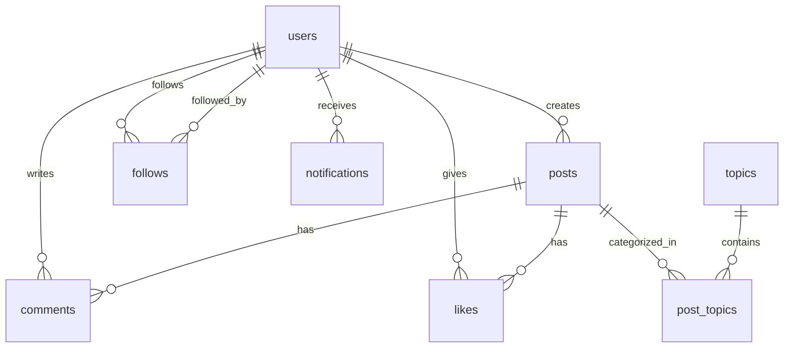

# Database Schema

## Tables

### users

- **id** (UUID, PK)
- **auth0_id** (VARCHAR, Unique)
- **username** (VARCHAR, Unique)
- **email** (VARCHAR, Unique)
- **avatar_url** (TEXT)
- **bio** (TEXT)
- **interests** (TEXT[])
- **created_at**, **updated_at**

### posts

- **id** (UUID, PK)
- **user_id** (UUID, FK -> users.id)
- **content** (TEXT)
- **image_url** (TEXT)
- **created_at**, **updated_at**, **deleted_at**

### topics

- **id** (UUID, PK)
- **name** (VARCHAR, Unique)
- **slug** (VARCHAR, Unique)
- **description** (TEXT)

### post_topics (Many-to-Many)

- **post_id** (FK -> posts.id)
- **topic_id** (FK -> topics.id)

### comments

- **id** (UUID, PK)
- **post_id** (FK -> posts.id)
- **user_id** (FK -> users.id)
- **content** (TEXT)

### likes

- **post_id** (FK -> posts.id)
- **user_id** (FK -> users.id)

### follows

- **follower_id** (FK -> users.id)
- **following_id** (FK -> users.id)

### notifications

- **id** (UUID, PK)
- **user_id** (FK -> users.id)
- **type** (ENUM: like, comment, follow)
- **from_user_id** (FK -> users.id)
- **post_id**, **comment_id**, **is_read**

### reports

- **id** (UUID, PK)
- **post_id**, **user_id**
- **reason**, **status**

---

## Entity Relationship Diagram

## Indexes

- **users:** `email`, `username`
- **posts:** `user_id`, `created_at`, `content` (Full Text)
- **notifications:** `user_id`, `is_read`

## Notes

- Soft deletes enabled for posts and topics (`deleted_at`).
- Full-text search enabled on post content.
- Enums used for notification types and report statuses.
