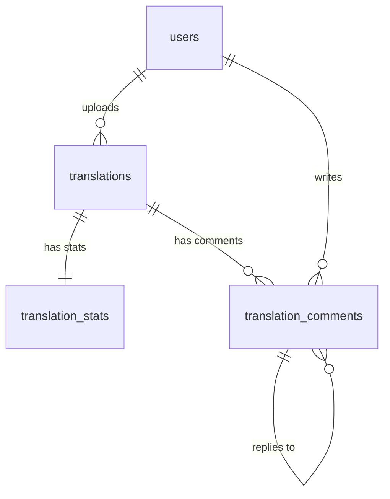

# Proposal: Database Schema Extensions for Manga Reader Social Features

This document outlines the proposed database schema changes to support community engagement, social features, and discoverability for the Manga Translation Reader.

## 1. Engagement & Statistics

### `translation_stats`

Tracks aggregated metrics for each translation to support trending algorithms and high-performance UI displays.

| Column             | Type          | Description                                      |
| :----------------- | :------------ | :----------------------------------------------- |
| **translation_id** | UUID (PK, FK) | Reference to `translations.id`                   |
| **view_count**     | BIGINT        | Total distinct views (registered on reader open) |
| **upvote_count**   | INTEGER       | Total positive reactions                         |
| **comment_count**  | INTEGER       | Total comments on this translation               |
| **updated_at**     | TIMESTAMPTZ   | Last time any stat was updated                   |

**Indexes:**

- `idx_translation_stats_upvotes`: `upvote_count` DESC (For sorting by popularity)
- `idx_translation_stats_views`: `view_count` DESC (For sorting by trending)

---

### `reactions` (Modified)

Extend the existing reaction system to support translations.

- **Action**: Update `reactions_target_type_check` constraint.
- **New Array**: `['POST', 'COMMENT', 'TRANSLATION']`

---

## 2. Social Interactions

### `translation_comments`

Differentiating translation comments from post comments allows for specific features (like pinned translator notes in comments) and cleaner data boundaries.

| Column             | Type          | Description                                          |
| :----------------- | :------------ | :--------------------------------------------------- |
| **id**             | UUID (PK)     | Unique comment ID                                    |
| **translation_id** | UUID (FK)     | Reference to `translations.id`                       |
| **user_id**        | UUID (FK)     | Reference to `users.id` (Author)                     |
| **parent_id**      | UUID (FK)     | Reference to `translation_comments.id` (For replies) |
| **content**        | VARCHAR(1000) | Comment text content                                 |
| **image_url**      | VARCHAR(500)  | Optional attachment                                  |
| **created_at**     | TIMESTAMPTZ   | Creation timestamp                                   |
| **deleted_at**     | TIMESTAMPTZ   | Soft delete support                                  |

---

## 3. Translator Profiles & Identity

### `users` (Modified)

Enhance user profiles with translator-specific fields and aggregate performance metrics.

| Column                  | Type         | Description                                  |
| :---------------------- | :----------- | :------------------------------------------- |
| **group_name**          | VARCHAR(100) | Name of the scanlation group (if applicable) |
| **total_manga_views**   | BIGINT       | Sum of views across all translations         |
| **total_manga_upvotes** | BIGINT       | Sum of upvotes across all translations       |

---

## 4. Home Feed & Discoverability

The home feed "Translations" tab will primarily use the following query patterns:

1. **Latest Translations**:

   ```sql
   SELECT * FROM translations
   WHERE status = 'PUBLISHED'
   ORDER BY published_at DESC LIMIT 20;
   ```

2. **Trending Translations**:
   ```sql
   SELECT t.*, s.upvote_count, s.view_count
   FROM translations t
   JOIN translation_stats s ON t.id = s.translation_id
   WHERE t.status = 'PUBLISHED'
   ORDER BY (s.upvote_count * 10 + s.view_count) DESC -- Example ranking algorithm
   LIMIT 10;
   ```

---

## 5. Summary of Entities (Mermaid)


